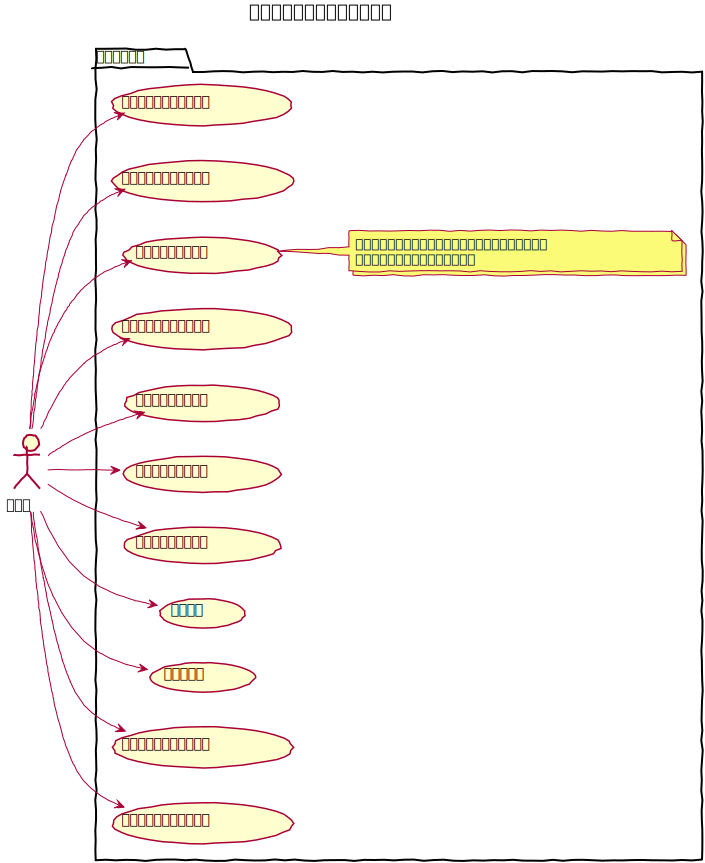
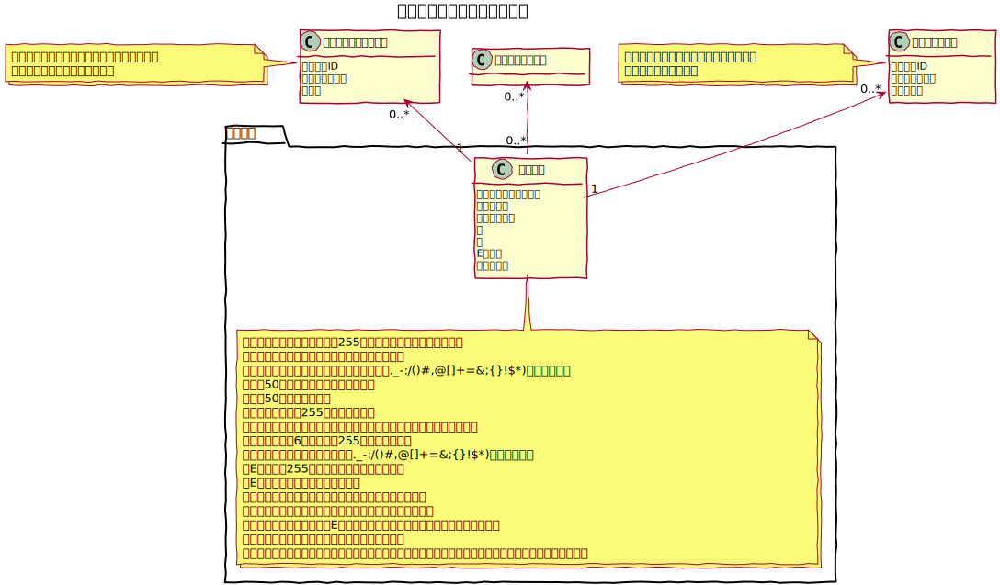
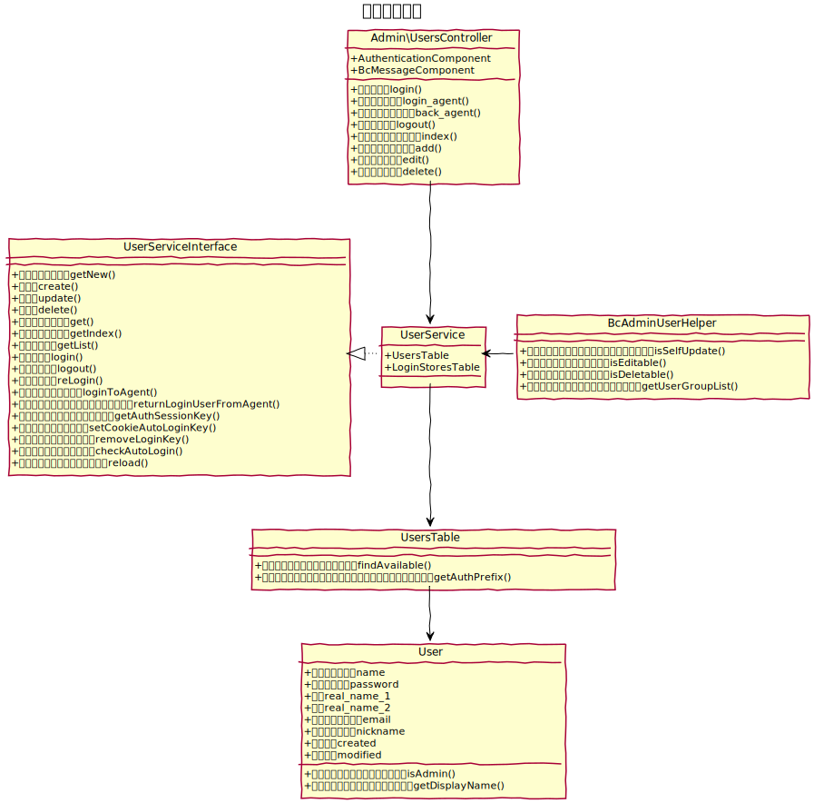
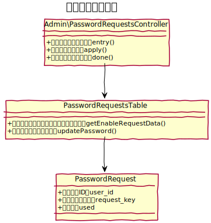
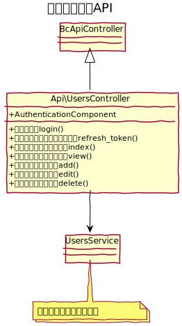

# ユーザー設計書

管理画面にログインするためのユーザーを管理する。

## ユースケース図

　
## 機能
### ログイン
ステータスが有効なユーザーは、ログインアカウント名、またはEメールと、パスワードの組み合わせでログインできる。

### ログイン状態の保存
ログイン時に「ログイン状態を保存する」にチェックを入れてログインするとブラウザを閉じてログインせずに管理画面を表示することができる。  
保存する期間はデフォルトで１年間とする。

### パスワード再発行
パスワードを忘れた場合に再発行を行う。Eメールアドレスを登録すると、再発行用のメールを対象Eメールアドレス宛に送信し、メールに記載されたリンクをクリックすると パスワードの変更画面でパスワードを変更できる。

### 一覧
ユーザーの一覧を表示し、ユーザーグループで絞り込む事ができる。
また、アクションとして次の機能を実行する事ができる。
- ページネーション
- 表示件数切替
- 表示並び替え
- 登録（画面へ遷移）
- 編集（画面へ遷移）
- コピー（コピー後は一覧に遷移）
- 削除（削除後は一覧に遷移）

システム管理者のみ実行可能。

### 新規登録
新しいユーザーを新規に登録できる。  
システム管理者のみ実行可能。

### 編集
既存のユーザーを編集できる。  
基本的にシステム管理者のみ実行可能だが、ログインユーザーは自身の情報のみ編集が可能。

### 削除
既存のユーザーを削除する。システム管理ユーザーの最後のユーザーは削除できない。  
システム管理者のみ実行可能。

### 代理ログイン
システム管理ユーザーがシステム管理ユーザー以外のユーザーに対して、一時的にログインできる。  
ツールバーの「元のユーザーに戻る」を実行することで元のユーザーに戻ることができる。

　
## ucmitzにおける仕様変更

### お気に入り初期値の廃止
自身のお気に入りを、所属するグループの初期値に設定する機能は廃止します。  
理由は、baserCMS4の新しい管理画面デザインになってメニュー構成が変更となり、お気に入りがより個人のお気に入りとして利用する事できるようになったためです。

### 複数ユーザーグループへの所属可
baserCMS４までは、一つのユーザーグループにしか所属できませんでしたが、baserCMS５では、複数のユーザーグループに所属が可能とします。

　
## ドメインモデル図

　
## クラス図
### ユーザー管理

　
### パスワード再発行

　
### ユーザーAPI

