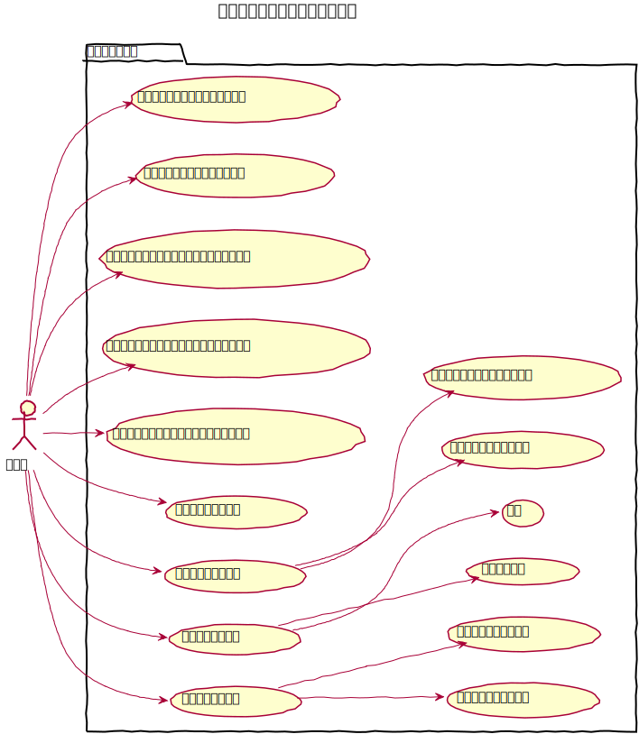
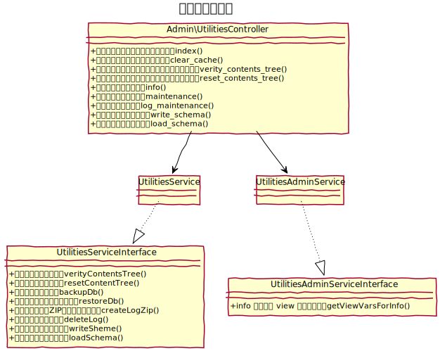

# ユーティリティ設計書

各種ユーティリティ機能を提供

## ユースケース図

　
## 機能
### ユーティリティトップを表示する
ユーティリティのトップを表示。

　
### サーバーキャッシュを削除する
`/tmp/cache/` 配下のキャッシュファイルを削除する。

　
### コンテンツ管理のツリー構造をチェックする
コンテンツ管理におけるツリー構造に問題がないかチェックを行う。  
問題があった場合は、`/logs/error.log` にエラー内容を出力する。

　
### コンテンツ管理のツリー構造をリセットする
コンテンツ管理のツリー構造を全てフラットな状態にリセットする。

　
### スペシャルサンクスクレジットを表示する
baserCMSについての貢献者をエンドロール形式で表示する。

　
### 環境情報を表示する
phpinfo と次の情報を表示する
- 設置フォルダ
- データベース
- baserCMSバージョン
- CakePHPバージョン

　
### データメンテナンス
#### バックアップを作成する
CSVファイルとしてZipでバックアップファイルを作成しダウンロードする事ができる。  
baserCMSコアと有効となっているプラグインに関連するテーブルを対象とする。
スキーマファイルはCakePHPのマイグレーションファイルとするが、データに関してはシーダーは再利用しづらいので、CSVファイルとする。
#### バックアップからリストアする
上記バックアップファイルよりデータを復元する。

　
### ログメンテナンス
#### ログファイルダウンロード
エラーログファイル等をZipでまとめてダウンロードする事ができる。
#### ログファイル削除
サーバー上のログファイルを全て削除する。

　
### マイグレーションファイル
データベースのテーブルの構造情報を定義するファイルの生成と読込ができる。  
プラグインを作成する際などに利用する。
#### マイグレーションファイル生成
現在のデータベースの状態よりテーブルを指定してマイグレーションファイルを作成してダウンロードする事ができる。
#### マイグレーションファイル読込
作成したマイグレーションファイルをアップロードして現在のデータベースに適用する事ができる。

　
## クラス図
### ユーティリティ

　
