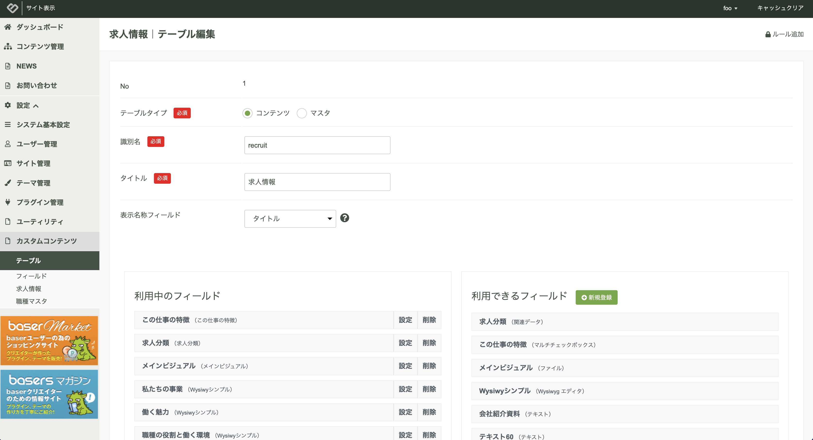
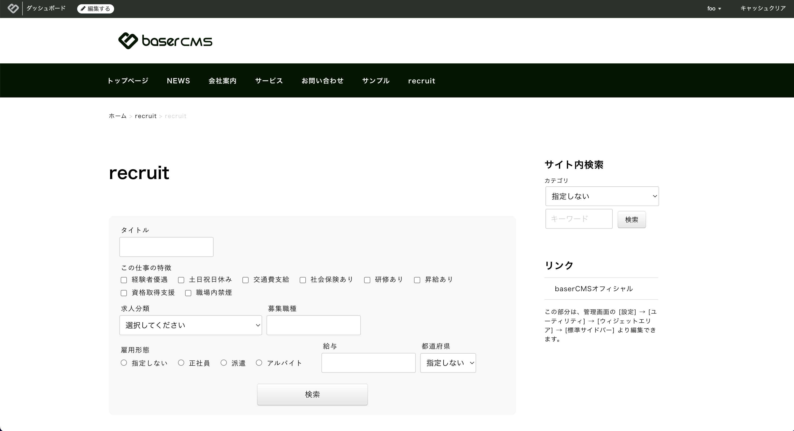
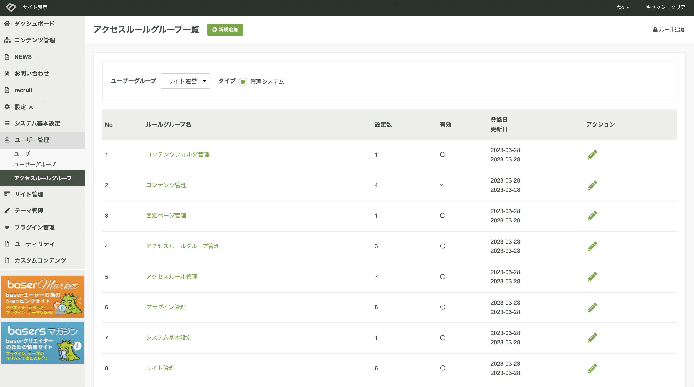
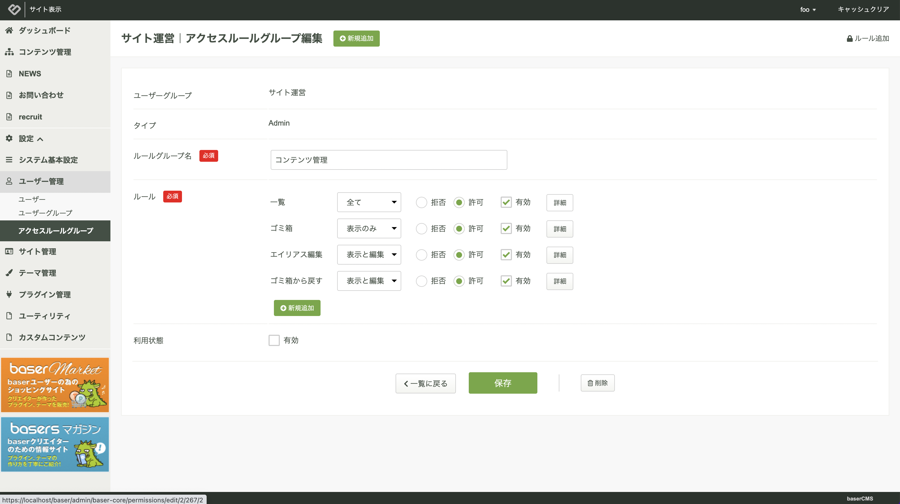
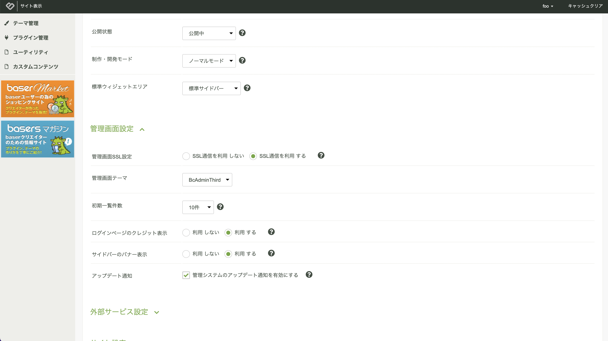
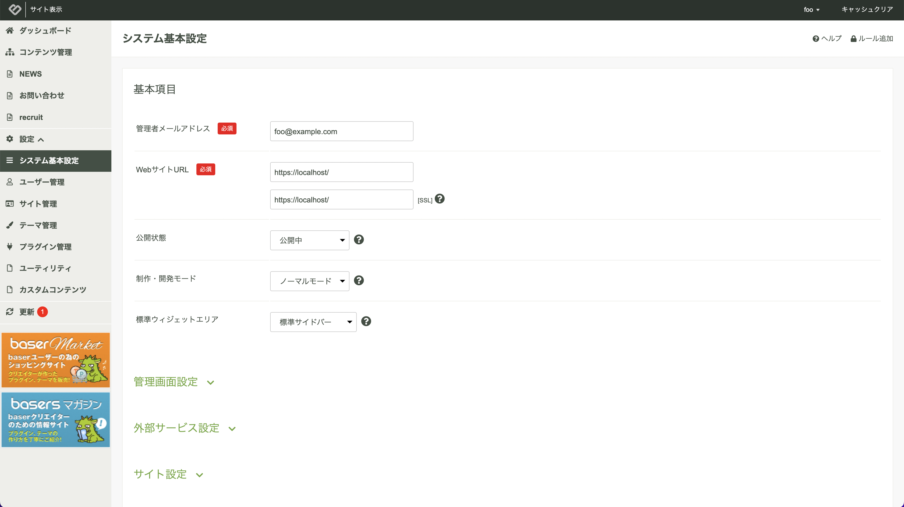
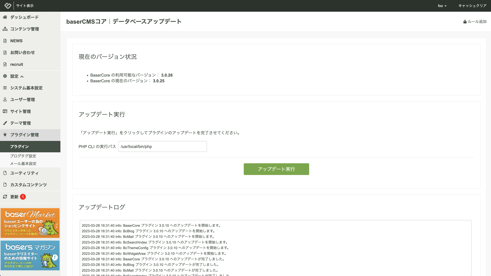

# baserCMS５ツアー

baserCMSはこれまでCakePHP２系という古いアーキテクチャで10年以上の間、メンテナンスを続けてきましたが、バージョン５では、最新版のCakePHP４に刷新し、メンテナンス性とカスタマイズ性が高いWebアプリケーション開発プラットフォームとしても利用できるように生まれ変わりました。  

ここでは大きな変更点となる部分を説明します。

## カスタムコンテンツ
カスタムコンテンツとは、管理画面においてノーコードでオリジナルコンテンツのフィールドを定義し、そのコンテンツに対する管理機能とフロントエンドに表示するための仕組みを提供する機能です。  
詳細については、[カスタムコンテンツ](functions/bc-custom-content) をご覧ください。

### カスタムコンテンツの作成の流れ
1. プラグインをインストールする
2. カスタムフィールドを定義する
2. カスタムテーブルを作成する
3. カスタムテーブルとカスタムフィールドを紐付ける
4. コンテンツ管理でカスタムコンテンツを作成する
5. カスタムコンテンツとカスタムテーブルを紐付ける
6. カスタムエントリーを登録する
7. フロントページを確認する

#### 1. プラグインをインストールする
設定 → プラグイン管理より、BcCustomContent（カスタムコンテンツ）のインストールボタンをクリックし、インストールを実行します。

設定メニューの中に「カスタムコンテンツ」が追加されます。

#### 2. カスタムフィールドを定義する
カスタムフィールドとは、オリジナルのフィールドを定義できる機能です。

設定 → カスタムコンテンツ → フィールドより、フィールドの定義を行います。  


新規登録ボタンより新しいフィールドを定義します。  
タイプを選択し必要事項を入力すると画面下にコントロールのプレビューを表示します。


#### 3. カスタムテーブルを定義する
カスタムテーブルとは、コンテンツ管理で利用できるコンテンツテーブル、または、カテゴリやタグのマスターとして利用するためのマスターテーブルです。

設定 → カスタムコンテンツ → テーブルより、テーブルを作成します。


新しいテーブル名入力して一度保存すると、テーブルとフィールドの紐付けができるようになります。  

「利用できるフィールド」に先ほど定義したカスタムフィールドの一覧が表示されていますので、必要なものを「利用中のフィールド」にドラッグアンドドロップで移動します。

「利用中のフィールド」における並び順が、管理画面のカスタムエントリー入力画面の並び順となりますので、適宜、ドラッグアンドドロップで並び順を入れ替えます。



なお、「利用中のフィールド」のフィールドの「設定」をクリックすると名称を変更できます。

また、「詳細編集」ボタンをクリックする事で、入力必須や、説明文、注意書き、前見出し、後見出しなど、管理画面のカスタムエントリー入力画面の表示に関わる部分の設定ができ、こちらも画面下部でプレビューを確認する事ができます。


#### 4. コンテンツ管理でカスタムコンテンツを作成する
作ったテーブルは、マスターメンテナンス用の管理画面としても利用する事ができますが、フロントページに表示するには、コンテンツ管理でカスタムコンテンツを作成し、テーブルと紐付ける必要があります

コンテンツ管理を開き、配置対象のフォルダを右クリックし、「カスタムコンテンツ」を選択します。


#### 5. カスタムコンテンツとカスタムテーブルを紐付ける

カスタムコンテンツの編集画面を開き、「テーブル」にて先ほど作成したテーブルを選択し保存します。  
公開状態が「公開する」となっている場合、画面左のメニューにテーブル名を表示します。


#### 6. カスタムエントリーを登録する
先ほど表示された画面左のメニューからエントリーを選択するとカスタムエントリーの一覧を確認できます。


新規登録をクリックすると新しいカスタムエントリーの登録画面に遷移します。  
カスタムテーブルで定義したフィールドで入力画面が構成されている事を確認できます。


#### 7. フロントページを確認する

ツールバーの「サイト確認」、または、プレビューをクリックする事でフロントページを確認できます。  
なお、こちらのレイアウトは、自動生成したものになっています。  
実際には、テンプレート上でフロントページ用のヘルパ関数を利用して自由に項目を配置する使い方を想定しています。


なお、パンくずの上位ページをクリックすると一覧も自動生成されている事が確認できます。  
初期状態では、検索項目も自動生成しています。




　
## REST API
ヘッドレス化の仕組みとして外部のアプリケーションよりアクセス可能な REST API を備えています。  
詳細については [Web APIガイド](web_api/) をご覧ください。

### REST API を利用する流れ
1. API を有効化する
2. エンドポイントにリクエストを送信する

#### 1. API を有効化する
`/config/.env` を編集します。
```php
USE_CORE_API="true"
```

#### 2. エンドポイントにリクエストを送信する
GETメソッドで、認証を必要としない次のエンドポイントにリクエストを投げます。

```shell
/baser/api/baser-core/contents.json
```

次のようなコンテンツ一覧のJSONデータが取得できます。この場合、公開状態のコンテンツのみが対象となります。

```json
{
    "contents": [
        {
            "id": 5,
            "name": "about",
            "plugin": "BaserCore",
            "type": "Page",
            "entity_id": 2,
            "url": "/about",
            "site_id": 1,
            "alias_id": null,
            "main_site_content_id": null,
            "parent_id": 1,
            "lft": 6,
            "rght": 7,
            "level": 1,
            "title": "会社案内",
            "description": "",
            "eyecatch": "",
            "author_id": 1,
            "layout_template": "",
            "status": true,
            "publish_begin": null,
            "publish_end": null,
            "self_status": true,
            "self_publish_begin": null,
            "self_publish_end": null,
            "exclude_search": false,
            "created_date": "2023-03-28T18:46:47+09:00",
            "modified_date": null,
            "site_root": false,
            "deleted_date": null,
            "exclude_menu": false,
            "blank_link": false,
            "created": "2023-03-28T18:46:37+09:00",
            "modified": "2023-03-28T18:46:47+09:00"
        },
        ・・・
    ]
}
```

他にも様々なエンドポイントがあります。 [baser API](./web_api/baser_api/) をご覧ください。

### 認証を必要とするエンドポイントへのアクセス
認証を必要とするエンドポイントへのアクセスは、JWT認証を利用します。詳しくは、[Web API ガイド](./web_api/) をご覧ください。

　
## アクセスルール
baserCMS４までは「アクセス制限設定」として提供していた機能が、「アクセスルール」へと名称を変更して、より細かな設定ができるようになりました。
詳細については、[アクセスルール](functions/baser-core/access_rule) をご覧ください。

### アクセスルールを利用する流れ
1. アクセスルールグループを開く
1. アクセスルールグループの詳細を開く
1. 許可、拒否の設定を行い保存する

#### 1. アクセスルールグループを開く
左メニューの 「設定」→「ユーザー管理」→「アクセスルールグループ」より、アクセスルールグループの一覧を開きます。



#### 2. アクセスルールグループの詳細を開く
設定を変更した対象のアクセスルールグループの「アクション」にある編集ボタンをクリックします。



#### 3. 許可、拒否の設定を行い保存する
「ルール」欄において対象機能の許可、拒否を設定し保存します。

なお、「有効」のチェックボックスを外すと、設定自体が存在しないものとみなします。  
その際の挙動については、対象となる領域がホワイトリスト方式となっているかブラックリスト方式になっているかで変わります。

- ホワイトリスト方式の場合：アクセスできなくなります。
- ブラックリスト方式の場合：アクセスできます。

ちなみに管理システムは、ホワイトリスト方式となります。

### 管理システム以外でのアクセスルールの利用
アクセスルールは、管理画面だけでなく、フロントページや、API、独自で開発するマイページなどでも利用が可能です。詳しくは、[アクセスルール](functions/baser-core/access_rule) をご覧ください。

　
## オートアップデート
オフィシャルのリリース情報を取得し、簡単にbaserCMSコアをアップデートする事ができる機能です。
詳細については、[オートアップデート](functions/baser-core/auto_update)をご連ください。

### オートアップデートを利用する流れ
1. オートアップデートを有効にする
2. 通知を確認する
3. アップデートを実行する

#### 1. オートアップデートを有効にする
システム基本設定より、「管理すステムのアップデート通知を有効にする」にチェックを入れます。



#### 2. 通知を確認する
新しいバージョンがリリースされた場合、メニュー一番左下に「更新」ボタンを表示します。  
赤いバッジの数値は、バージョンの差分数を表示しています。



#### 3. アップデートを実行する
「更新」ボタンをクリックするとアップデートの実行画面に移動します。  



アップデートを実行する際は、必ずバックアップを作成してから実行してください。

また、アップデートを実行するには、PHP CLI の実行パスが必要です。空欄になっている場合は、ホスティング会社等に確認し手動で入力してから実行してください。

### アップデートの対象
オートアップデートの対象は、パッチバージョンとマイナーバージョンが対象となり、メジャーバージョンではアップデートは実行できません。

また、パッチ、マイナーに問わず、暗黙的に自動でバージョンアップを行うようなことはありません。

　
## baserCMS４からの変更点
CakePHP４に対応することにより、アーキテクチャーも大幅に変更となり、テーマやプラグインの作り方も変更となっています。詳細についてはこちらをご覧ください。

- [baserCMS４からの変更点](./core/difference_from_basercms4)
- [baserCMS４からのアップグレードガイド](../ver5_migration)
　
